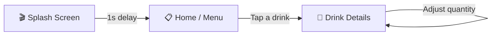

<div align="center">


# Coffee Drink App

**A pixel-crafted Flutter experience for browsing and ordering coffee & drinks**

[](https://flutter.dev)
[](https://dart.dev)
[](#)
[](#-contributing)
[](LICENSE)

<br/>

*No third-party animation packages. No bloated state-management boilerplate.*
*Just carefully composed Flutter widgets, transforms, and a lot of attention to detail.*

<br/>

<p align="center">
  
  
  
</p>

</div>

---

## 🌟 Overview

**Coffee Drink App** is a Flutter UI project that recreates the polished, animation-driven ordering flow of a modern coffee shop app. It's built as a showcase of clean widget composition and native-feeling motion — every transition, scale, and toggle is handwritten using Flutter's core animation primitives, with **zero external animation dependencies**.

The experience is split into three deliberate stages:

| Stage | Purpose |
|---|---|
| **1. Splash** | First impression — brand logo, timed auto-navigation |
| **2. Menu** | Browse — scrollable catalog with reactive depth animation |
| **3. Details** | Decide — immersive product view with full customization |

---

## ✨ Key Features

<table>
<tr>
<td width="50%">

**🎬 Animated Splash Screen**
Branded intro that transitions automatically into the main menu after a short delay — no user interaction required.

**📜 Scroll-Reactive Menu**
Drink cards scale dynamically in response to scroll offset via `AnimatedBuilder`, producing a soft depth/parallax feel with zero extra packages.

**🌀 3D-Style Carousel**
A custom `PageView.builder` scales and translates neighboring pages based on distance from the active index — a native carousel effect built from scratch.

</td>
<td width="50%">

**📏 Dynamic Size Selector**
Four tappable size options rendered from SVG assets, each with distinct selected/unselected visual states.

**🔥❄️ Hot / Iced Toggle**
A pill-shaped `AnimatedContainer` toggle that smoothly slides between temperature states.

**➕➖ Quantity Stepper**
A minimal, validated counter that prevents the quantity from dropping below one.

</td>
</tr>
</table>

---

## 🔄 App Flow



---

## 📸 Screenshots

> Add real captures here once available — this is one of the highest-impact sections for first impressions on GitHub.

<div align="center">

| Splash | Home | Details |
|:---:|:---:|:---:|
| _screenshot here_ | _screenshot here_ | _screenshot here_ |

</div>

<details>
<summary>💡 How to capture good screenshots</summary>

```bash
flutter screenshot --out=screenshots/home.png
```

Or use your emulator's built-in screenshot tool, then drop the images into a `screenshots/` folder and update the table above with:

```markdown

```

</details>

---

## 🗂️ Project Structure

```
lib/
├── main.dart                   # App entry point & MaterialApp root
├── splash.dart                  # Splash screen with delayed navigation
├── home.dart                    # Menu screen with animated drink list
├── details.dart                  # Drink details with carousel & ordering controls
├── model.dart                    # DrinkModel + sample dataset
└── components/
    ├── drink.dart                  # Drink card used in the menu list
    └── toggle_widget.dart          # DrinkToggle (Hot/Iced) & QuantitySelector
```

---

## 🔬 How It's Built

A quick look at the two techniques that give this app its distinctive feel.

<details>
<summary><strong>1. The scroll-reactive menu list</strong></summary>

Each item listens to the shared `ScrollController` and computes its own scale based on how far it is from the current scroll offset:

```dart
AnimatedBuilder(
  animation: controller,
  builder: (context, child) {
    double offset = controller.hasClients
        ? (controller.offset / 100 - index).clamp(0, 1)
        : 0;
    return Transform.scale(
      scale: 1 - (offset * 0.2),
      child: Drink(/* ... */),
    );
  },
);
```

This avoids rebuilding the entire list on every scroll tick — only the transform recalculates.

</details>

<details>
<summary><strong>2. The 3D-style details carousel</strong></summary>

The `PageController`'s current page drives both a scale and a horizontal translation for every visible page, creating a depth illusion without any carousel package:

```dart
final scale = drinkSize - (_currentPage - index).abs();
final translateY = (_currentPage - index).abs() * 400;

Transform.translate(
  offset: Offset(translateY, 0),
  child: Transform.scale(
    scale: scale.clamp(0.5, 1.0),
    child: /* drink image */,
  ),
);
```

</details>

---

## 🧩 Data Model

Each drink is represented by a small, extensible model — easy to map onto a real API response:

```dart
class DrinkModel {
  final String image;
  final String name;
  final String title;
  final String price;
  final double? height;
  final double? rightOffset;
  final double? leftOffset;
}
```

Sample data currently lives in a static list, `DrinkModel.drinks`, inside `model.dart`. Swapping it for live data (REST, Firebase, GraphQL) requires no changes to the UI layer.

---

## 🛠️ Tech Stack

| Category | Details |
|---|---|
| **Framework** | [Flutter](https://flutter.dev) |
| **Language** | Dart |
| **Packages** | [`flutter_svg`](https://pub.dev/packages/flutter_svg) — SVG icon rendering |
| **State Management** | Native `StatefulWidget` / `setState` |
| **Animation** | `AnimatedContainer`, `AnimatedBuilder`, `Transform.scale`, `Transform.translate` |
| **Navigation** | `Navigator.push` / `pushReplacement` with `MaterialPageRoute` |

---

## 🚀 Getting Started

### Prerequisites

- [Flutter SDK](https://docs.flutter.dev/get-started/install) 3.x+
- Android Studio / Xcode or a configured emulator
- A physical device or simulator

### Installation

```bash
# Clone the repository
git clone https://github.com/<your-username>/coffee-drink-app.git
cd coffee-drink-app

# Install dependencies
flutter pub get

# Run the app
flutter run
```

### Assets Setup

Declare these under `flutter: assets:` in `pubspec.yaml`:

```yaml
flutter:
  assets:
    - assets/logo/logo.png
    - assets/cart.png
    - assets/Vector.svg
    - assets/drinks/
```

Required images referenced in `model.dart` (place inside `assets/drinks/`):

- `Banana.png`
- `Salted Caramel.png`
- `Chocolate.png`
- `Strawberry.png`
- `Ellipse 2.png`

---

## 🎨 Design System

| Token | Value | Usage |
|---|---|---|
| Primary Accent | `#FEB60D` | Splash background, highlights |
| Selected State | `Colors.orange` | Size selector, active toggle |
| Surface | `Colors.white` | Cards, backgrounds |
| Border Radius | `20–40px` | Cards, toggles, buttons |
| Elevation | `3` | Menu cards |

Layout leans on `Stack` + `Positioned` for precise layered compositions rather than deeply nested `Row`/`Column` trees — keeping custom-shaped, overlapping UI (like the drink cards) simple to reason about.

---

## 🧭 Roadmap

- [ ] Connect `DrinkModel` to a live backend (REST API / Firebase)
- [ ] Build a fully functional shopping cart with order summary
- [ ] Persist selected size, temperature, and quantity per order
- [ ] Introduce scalable state management (Provider / Riverpod / Bloc)
- [ ] Add unit and widget test coverage
- [ ] Add light/dark theme support
- [ ] Add localization (multi-language support)

---

## 🤝 Contributing

Contributions, issues, and feature requests are always welcome!

1. Fork the project
2. Create your feature branch: `git checkout -b feature/amazing-feature`
3. Commit your changes: `git commit -m 'Add amazing feature'`
4. Push to the branch: `git push origin feature/amazing-feature`
5. Open a Pull Request

Please open an [issue](../../issues) first for major changes to discuss what you'd like to change.

---

## 📄 License

Distributed under the **MIT License**. See [`LICENSE`](LICENSE) for more information.

---

<div align="center">

**☕ Built with Flutter, precision, and a genuine love for good coffee UI.**

<sub>If you found this project useful, consider giving it a ⭐ on GitHub!</sub>

</div>
